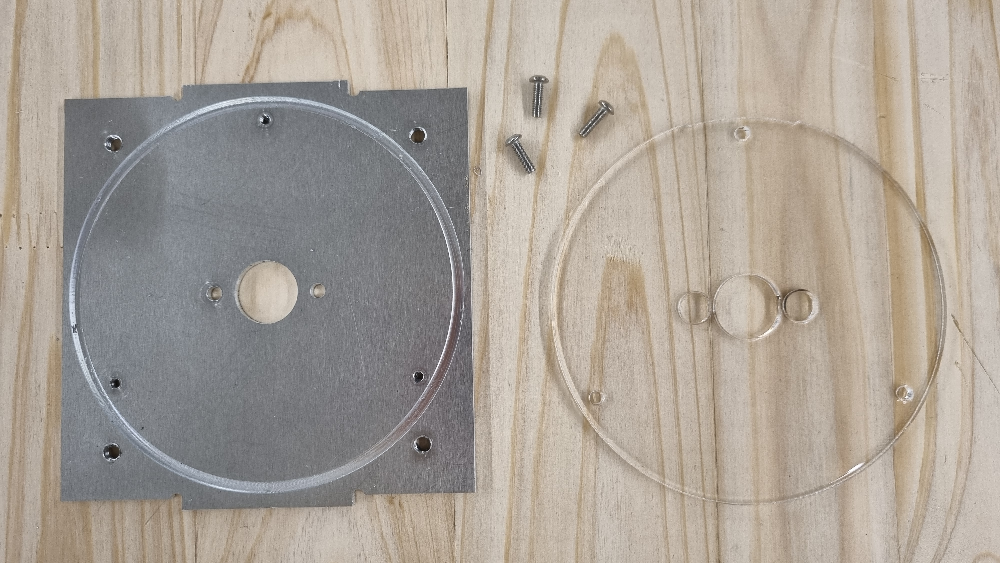

# Coffee-Grinder
An Open Source Coffe Grinder made with a Pop-up Factory and Open Hardware Fab Lab Machines

# Specifications

- CNC milled 3mm aluminum housing
- 12V 775 DC Motor
- CNC milled grinding blade with bending
- adjustable speed
- grinding time: about 1 minute
- 3D printed screwable cap
- laser cut polypropylene grinding area

# Assembly Instructions

## **Sub Assembly A: grinding chamber**

 
1. Attach big acrylic disc to aluminium square with 3 central holes using M3x10mm bolts (this assabled part will be refered in the next steps as "botom of the grinding chamber").
  

 
2. Attach the DC motor to the bottom ginding chamber using 2 M4x10 bolts.
  

 

     

The blade should be assembled to the motor coupler using 4 M3x10mm bolts and 4 M3 Locknuts. To secure the motor coupler to the motor´s shaft you need to tighten  the 2 setscrews.

 
3. Attach the male part of the M5x60mm standoffs to the bottom ob the grinding chamber.  

 
5. Place the 3D printed cap to the square aluminum piece with the big hole in the center so that the wider part of the printed part fits with the circle slot. (this assembled part will be refered as "top of the grinding chamber" in the next steps).  

 
For this step, you will need four M3x10mm and four M3 locknuts.  

 
5. Place the bolts so that their heads are opposite to the side of the circle slot.  

 
DO NOT overtighten, otherwise the 3D printed part will wrap.  

 
6. Attach the top of the grinding chamber and fasten it to the female part of the standoffs with 4 M5x12mm bolts.  

 
Do not tighten the bolts. The space between the top and the bottom part of the chamber should be enough to fit the green polypropilen stripe.  

 
7. Roll the green polypropilen stripe to form an overlaped cilinder inside the standoffs and fit it to the bottom and top circle pockets.  

   

 
8. Place the overlaped part in the pocket next to the centered bolt in the acrylic disc.  

 
9. Rotate the formed cylinder so the overlaped part remains behind one of the standoffs.  

 
10. While having the grinding chamber upside down place the front and back aluminium plates. The one with de centered hole is where the back, where the DC barrel jack connector goes.  

 
11. Flip the assembly and slide the two side aluminium plates from above.  

   

 
12. Slide the 2 aluminium reteiners them in to their corresponding notches and secure them to the side plates using 4 M4x10mm bolts.  

   

 
13. Attach the DC barrel jack connector to the back plate, secure it with the provided nut.  

 
14. Prepare the electronic parts. Cables, connectors and controller board.  

 
15. Make the 4 connections and check the position for the motor connection and the power connection.  

 
16. Attach the controller board the the front aluminium plate by srewing the shaft of the board through the hole located in the top right (or left) of the plate, secure it with the provided nut.  

 
17. Connect the cables to the motor and DC jack checking wich ones correspond to ground and vcc for each.  

 
18. Place the cap.  

 
19. Preesfit attachment of the small acrylic disc to the top 3D printed cap.  

 
20. Place the big cap.  

 

 

 

 

Author
--

The Coffe Grinder has been designed and built by **[InMachines Ingrassia GmbH](https://www.inmachines.net/)**.

 

Coffe Grinder design by:
- **[Wilhelm Schütze](http://fabacademy.org/archives/2015/sa/students/schutze.wilhelm/index.html)**

Contact
--

- daniele@inmachines.net
- [https://www.inmachines.net/](https://www.inmachines.net/)

License
--

The Coffe Grinde design, CAD and PCB files, BOM, settings and relative files are are released under the following open source license:

- CERN Open Hardware Licence Version 2 Weakly Reciprocal - **[CERN-OHL-W](LICENSE_CERN_OHL_W_V2.txt)**

The Coffe Grinder documentation, pictures and presentation text of this repository are released under the following license:

- Creative-Commons-Attribution-ShareAlike 4.0 International - **[CC BY-SA 4.0](LICENSE_CC_BY_SA_4.0.txt)**
