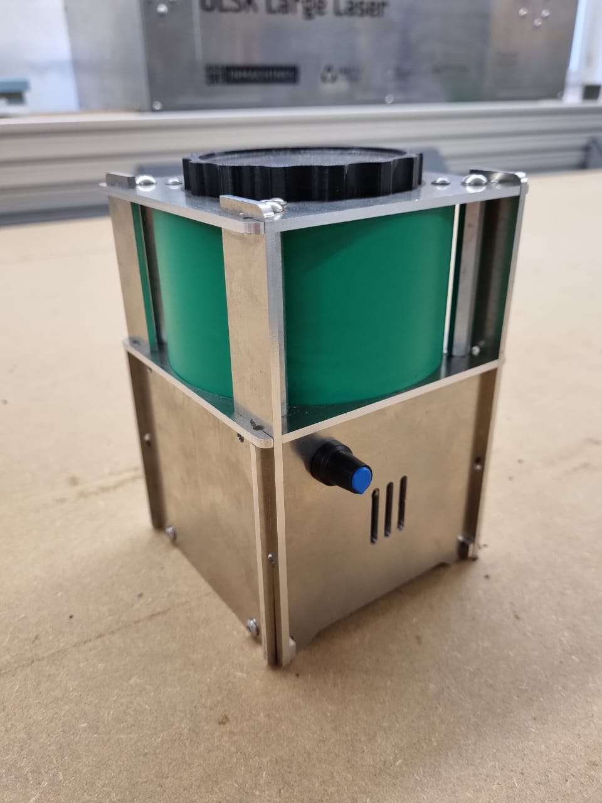

# Coffee-Grinder
An Open Source Coffe Grinder made with a Pop-up Factory and Open Hardware Fab Lab Machines

# Specifications

- CNC milled 3mm aluminum housing
- 12V 775 DC Motor
- CNC milled grinding blade with bending
- adjustable speed
- grinding time: about 1 minute
- 3D printed screwable cap
- laser cut polypropylene grinding area

# Assembly Instructions

## **Sub Assembly A: grinding chamber**

 
1. Attach big acrylic disc to aluminium square with 3 central holes using M3x10mm bolts (this assabled part will be refered in the next steps as "botom of the grinding chamber").
  

 
2. Attach the DC motor to the bottom ginding chamber using 2 M4x10 bolts.
  

 
## **Sub Assemby B: Blade**

1. Fasten the blade to the motor coupler using 4 M3x10mm bolts and 4 M3 Locknuts. 2. Attach the 2 M3 setscrews to the shaft of the motor coupler

  

     

 
3. Place the 3D printed cap to the square aluminum piece with the big hole in the center so that the wider part of the printed part fits with the circle slot. (this assembled part will be refered as "top of the grinding chamber" in the next steps).  

 
For this step, you will need four M3x10mm and four M3 locknuts.  

 
4. T.  

 

 

 

 

 

 

   

 

 

3. Attach the male part of the M5x60mm standofs to the bottom ob the grinding chamber.

4. Roll the green polypropilen stripe to form an overlaped cilinder and fit it to the bottom of the ginding chamber´s grove formed by the space between the acrylic disc and the pocket of the aluminium piece.

5. Fit the  top of the grinding chamber the top of PP roll previously fited on the botom of the grinding chamber and fasten it to the female part of the standoffs with 4 M5x12mm bolts.

6. 

##**Sub Assembly C: Electronics**

1. Attach the controller board the the front aluminium plate by srewing the shaft of the board throu the big hole located in the top left of the plate, secure it with the provided nut.

2. Attach the DC barrel jack connector to the back aluminium plate fitting it in to the hole located on the lower middle part.

## **Sub Assembly D: Cap**

1. Preesfit attachment of the small actilic disc to the top 3D printed cap.

## **MAIN ASSEMBLY**

1. Attach the 4 side aluminium plates to the grinding chamber by sliding them in to their corresponding notches.

2. Attach the front and back plates (with the already attached electronic components) to the assembled side plates that are now part of the main assembly with the grinding chamber by slidind them in to their corresponding notches.

3. Attach the 2 aluminium reteiners to the botom part of the already assembled front, back and side plates by sliding them in to their corresponding notches and secure them to the side plates using 4 M4x10mm bolts.

4. Install the blade by sliding the motor coupler (attached to the balde) in to the motor shaft and secure it with the 2 M3 setscrews that were previusly attached on the motor coupler.

5. Attach the knob for the speed controller just by pusshing it in place.

6. Connect the power suplly to the DC barrel connector and the AC power cord to mains.

7. Test.

# Pictures

 

 

 

 

   

 

 

 

 

 

 

 

 

 
 

Author
--

The Coffe Grinder has been designed and built by **[InMachines Ingrassia GmbH](https://www.inmachines.net/)**.

 

Coffe Grinder design by:
- **[Wilhelm Schütze](http://fabacademy.org/archives/2015/sa/students/schutze.wilhelm/index.html)**

Contact
--

- daniele@inmachines.net
- [https://www.inmachines.net/](https://www.inmachines.net/)

License
--

The Coffe Grinde design, CAD and PCB files, BOM, settings and relative files are are released under the following open source license:

- CERN Open Hardware Licence Version 2 Weakly Reciprocal - **[CERN-OHL-W](LICENSE_CERN_OHL_W_V2.txt)**

The Coffe Grinder documentation, pictures and presentation text of this repository are released under the following license:

- Creative-Commons-Attribution-ShareAlike 4.0 International - **[CC BY-SA 4.0](LICENSE_CC_BY_SA_4.0.txt)**
